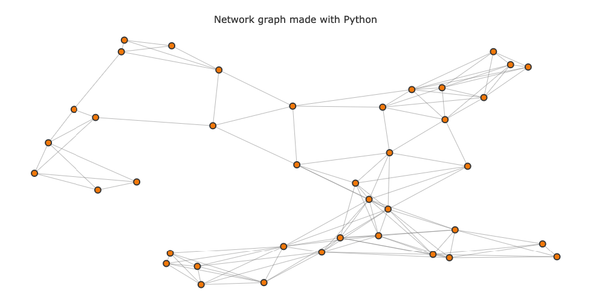
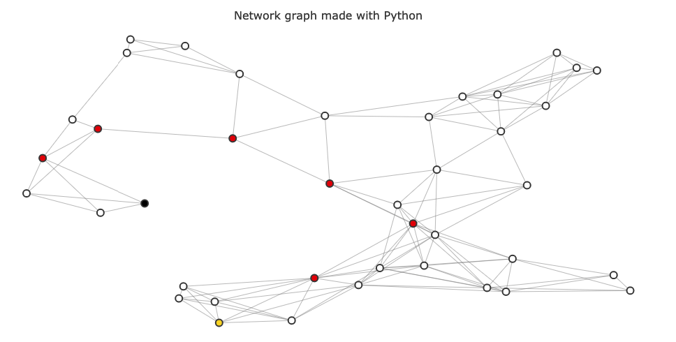
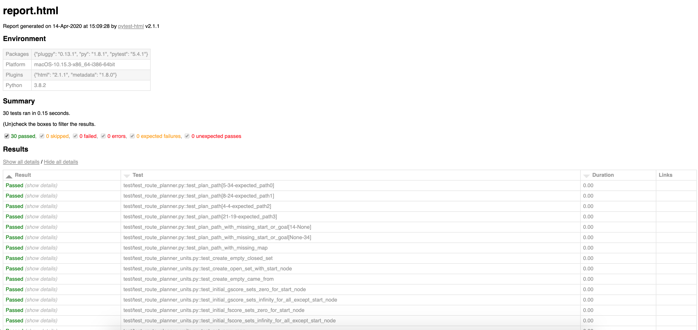
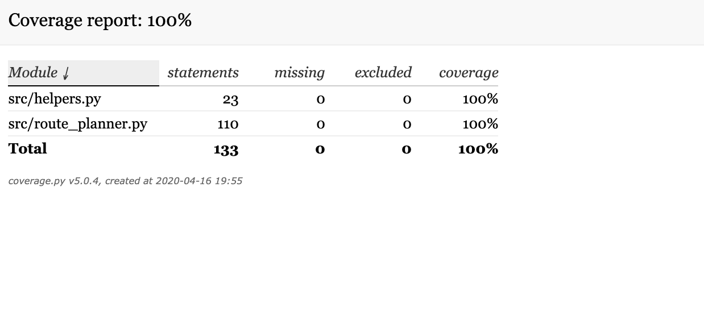

# Route Planner
Udacity Intro to Self-Driving-Car Nanodegree Project

## Table of Contents
* [Project Summary](https://github.com/jurayev/intro-sdc-route-planner-py#project-summary)
* [Dependencies](https://github.com/jurayev/intro-sdc-route-planner-py#dependencies)
* [Getting Started](https://github.com/jurayev/intro-sdc-route-planner-py#getting-started)
* [Dataset](https://github.com/jurayev/intro-sdc-route-planner-py#dataset)
* [Algorithm](https://github.com/jurayev/intro-sdc-route-planner-py#algorithm)
* [PathPlanner class](https://github.com/jurayev/intro-sdc-route-planner-py#pathplanner-class)
* [Tests](https://github.com/jurayev/intro-sdc-route-planner-py#tests)
* [License](https://github.com/jurayev/intro-sdc-route-planner-py#license)

## Project Summary
Implementation of a Google-maps style route planning algorithm using A-star search. The Algorithm calculates the shortest path between two points on a map.

Approach: In this project, I selected the A-Star search algorithm because it combines both Uniform cost search(keeps the path short) and Best First search(keeps focused on the goal) to implement Best estimated total path first(always expands towards the shortest path to the goal) algorithm.
A-Star search guarantees to find the shortest path from point A to point B.

## Dependencies
* `Python 3.5` or higher.
* `NetworkX` - Python package for the creation, manipulation, and study of the structure, dynamics, and functions of complex networks.
* `pickle` - used to create portable serialized representations of Python objects.
* `PyTest` - covers the code with unit tests
* `Coverage.py`- code coverage evaluation tool

## Getting Started
1. Clone repository
```
$ git clone https://github.com/jurayev/intro-sdc-route-planner-py
```
2. Navigate to project directory
```
$ cd intro-sdc-route-planner-py
```
3. Install dependencies
```
python3 setup.py install
```
4. Run Route Planner tests
```
$ python3 -m pytest --html=test/latest_reports/report.html
```
5. Run Route Planner tests with filters
```
$ python3 -m pytest -m unit --html=test/latest_reports/units_report.html
$ python3 -m pytest -m system --html=test/latest_reports/system_report.html
```
Reports are available here:
```
~ intro-sdc-route-planner-py/test/latest_reports/
```
6. Run with code coverage evaluation
```
$ coverage run --source=src/ -m pytest 
$ coverage html
```
Report is available here:
```
~ intro-sdc-route-planner-py/htmlcov/index.html
```

## Dataset
The dataset for testing Path Planner implementation consists of 2 maps with different size:
1. `map_10` - a map with 10 nodes.
2. `map_40` - a map with 40 nodes.

The map below shows a disconnected network of 40 intersections. This map is quite literal in its expression of distance and connectivity. On the graph below, the edge between 2 nodes(intersections) represents a literal straight road not just an abstract connection of 2 cities.



These Map objects have two properties needed to use to implement A* search: `intersections` and `roads`

### Intersections
The intersections are represented as a dictionary. For example:
```
> map_40.intersections
> {0: (0.7801603911549438, 0.49474860768712914),
   1: (0.5249831588690298, 0.14953665513987202),
   2: (0.8085335344099086, 0.7696330846542071),
   3: (0.2599134798656856, 0.14485659826020547),
   4: (0.7353838928272886, 0.8089961609345658),
   5: (0.09088671576431506, 0.7222846879290787),
   6: (0.313999018186756, 0.01876171413125327),
   7: (0.6824813442515916, 0.8016111783687677),
   8: (0.20128789391122526, 0.43196344222361227),
   9: (0.8551947714242674, 0.9011339078096633),
   10: (0.7581736589784409, 0.24026772497187532)
   }
```
Where the key is a intersection number and the value is an x,y coordinate.

### Roads
The roads property is a list where roads[i] contains a list of the intersections that intersection i connects to.
For example:
```
> map_40.roads[0]
> [36, 34, 31, 28, 17]
```
This shows that intersection 0 connects to intersections 36, 34, 31, 28 and 17 on the map

## Algorithm
The algorithm is written will be responsible for generating a `path` array of nodes. In fact, when called with the same map, start and goal, as the above algorithm should produce the path `[5, 16, 37, 12, 34]`.

```
> start = 8
> goal = 6
> PathPlanner(map_40, start, goal).path
> [8, 14, 16, 37, 12, 17, 15 , 6]
```

And here is a visual representation of found path:



## PathPlanner class
Let me very briefly walk through each part below.

`__init__` - We initialize our path planner with a map, M, and typically a start and goal node. If either of these is `None`, the rest of the variables here are also set to none. If we don't have both a start and a goal, there's no path to plan! The rest of these variables come from functions below: 
- `closedSet` includes any explored/visited nodes. 
- `openSet` are any nodes on our frontier for potential future exploration. 
- `cameFrom` will hold the previous node that best reaches a given node
- `gScore` is the `g` in our `f = g + h` equation or the actual cost to reach our current node
- `fScore` is the combination of `g` and `h`, i.e. the `gScore` plus a heuristic; total cost to reach the goal
- `path` comes from the `run_search` function, which is already built for you.

`reconstruct_path` - This function just rebuilds the path after the search is run, going from the goal node backward using each node's `cameFrom` information.

`_reset` - Resets *most* of our initialized variables for PathPlanner. This *does not* reset the map, start or goal variables.

`run_search` - This does a lot of the legwork to run the search. First, it checks whether the map, goal, and start have been added to the class. Then, it will also check if the other variables, other than `path` are initialized (note that these are only needed to be re-run if the goal or start were not originally given when initializing the class, based on what we discussed above for `__init__`.

From here, we use a function `is_open_empty`, to check that there are still nodes to explore (we need to make sure to feed `openSet` the start node to make sure the algorithm doesn't immediately think there is nothing to open!). If we're at our goal, we reconstruct the path. If not, we move our current node from the frontier (`openSet`) and into explored (`closedSet`). Then, we check out the neighbors of the current node, check out their costs, and plan our next move.

This is the main idea behind A*.

## Tests
Since my background comes from QA and Testing, I understand that testing your code is equally important as writing this code.
Besides the visual evaluation of the constructed path, I created unit tests that check every single component of the PathPlanner class and system tests that are responsible for verifying the found path.

Here is the test result report after running all tests using `PyTest` Framework runner:



The production code has 100% code coverage metrics measured by `Coverage.py` tool. The coverage report is shown below:



## License
The content of this repository is licensed under a [MIT License](https://github.com/jurayev/intro-sdc-route-planner-py/blob/master/LICENSE.md).
